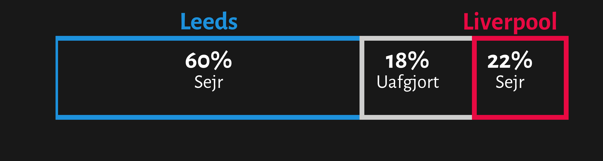

# Improving Match xG Infographics

In this project I will make my attempt to improve the common used Expected Goals (xG) race chart from a single game.
This will be done by adding more context like win, loss and draw probabilities, the 3 most probable scorelines and the probability for goals for each team.

- `probability_functions.py` contains functions for calculating win, loss and draw probabilities, scoreline probabilities and probabilities for 0-10 goals for each team
- `xG_Infographic.ipynb` contains loading and preperation of the data, and also the code for the visualizations of the seperate parts and the complete "improved" xG Infographic
- `output` contains all the visualizations

### Win, loss, and draw probabilities

### Scoreline probabilities

### Goals probabilities for each team

