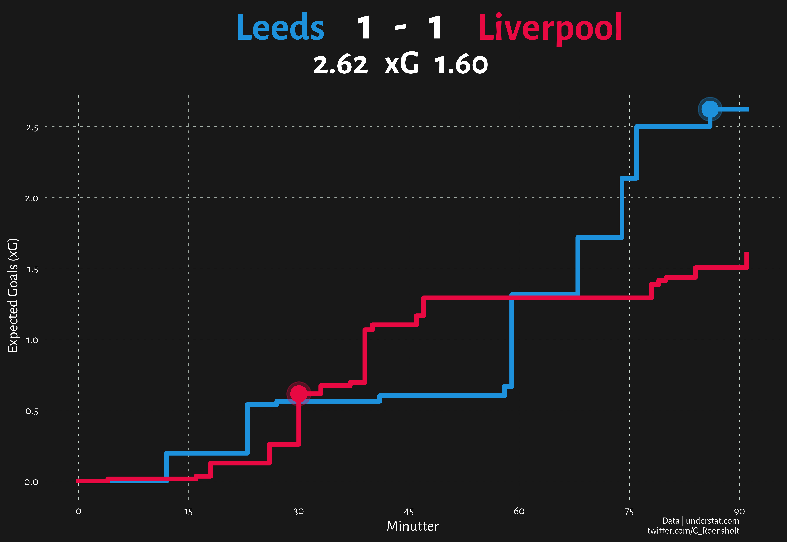
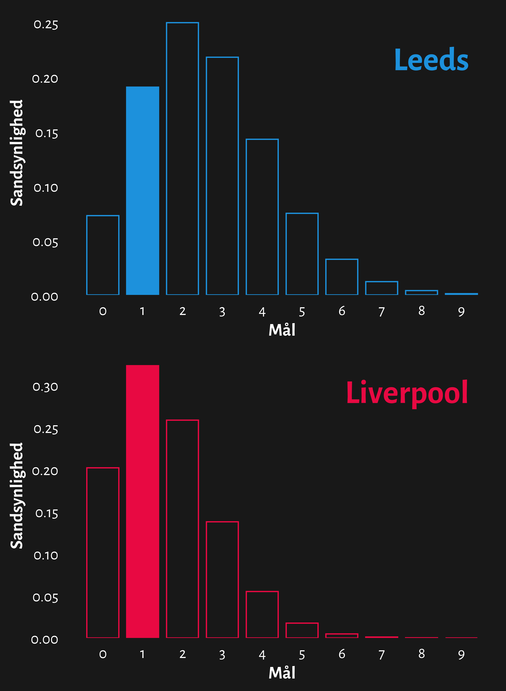

# Improving Match xG Infographics

In this project I will make my attempt to improve the common used Expected Goals (xG) race chart from a single game.
This will be done by adding more context like win, loss and draw probabilities, the 3 most probable scorelines and the probability for goals for each team.

- `utils` folder
  - `probability_functions.py` functions for calculating win and draw probabilities, scoreline probabilities and probabilities for 0-9 goals for each team
  - `cleaning.py`
  - `metadata.py`
- `xG_Infographic.ipynb` code for the complete xG Infographic
- `goal_probabilities_plot.py`
- `win_probability_plot.py`
- `xG_racechart_plot.py`
- `output` folder contains all the visualizations

## xG Infographic

## xG infographic breakdown
- **xG racechart**

- **Goal probabilities for each team**

Bar chart of 0-9 goals for each team, where the actual goal(s) scored is filled.

- **Win probability**

